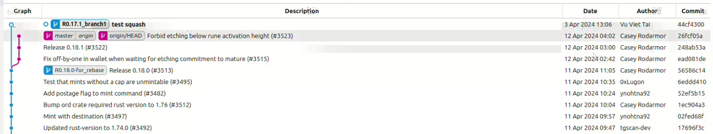

# git squash: Combine many git commits into 1 commit

## Step 1: Clone project

Clone the repository from github:
```bash
git clone <git-url>
```

")

## Step 2: Squash many commits 

Create a copy branch from the old branch: the new branch is called branch1


Checkout to branch1 and use git rebase to compress all commit on branch1 to the last commit we want to combine:
```bash
git checkout <branch1>
git rebase -i <hash_id>
```
- <branch1>: name of branch1
- <hash_id>: hash id of the expected commit

Preverse the first "pick" word and change all after to "squash" -> save


Rewrite the commit message -> save


The branch1 now has only 1 commit


## Step 3: Rebase branch

Create new branch on the commit we want to rebase branch1 onto, called branch2

```bash
git checkout <branch1>
git rebase <branch2>
```



Done!

